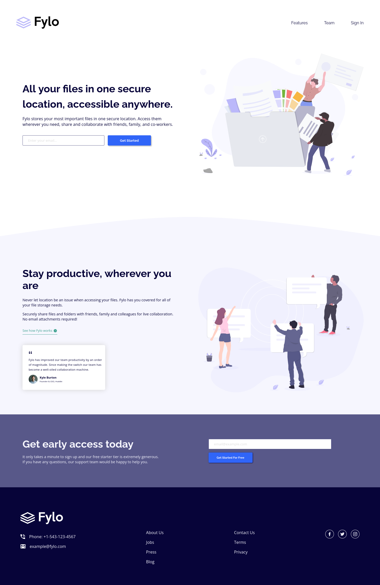

# Frontend Mentor - Fylo landing page with two column layout solution

This is a solution to the [Fylo landing page with two column layout challenge on Frontend Mentor](https://www.frontendmentor.io/challenges/fylo-landing-page-with-two-column-layout-5ca5ef041e82137ec91a50f5). The live version of the site can be seen [here](https://elyosis.github.io/fylo-landing-page/).

[Facebook](https://icons8.com/icon/87264/facebook-f), [Twitter](https://icons8.com/icon/102916/twitter) and [Instagram](https://icons8.com/icon/DpOQ6G5p47f0/instagram) icons by [Icons8](https://icons8.com).

## Table of contents

- [Overview](#overview)
  - [The challenge](#the-challenge)
  - [Screenshot](#screenshot)
- [My process](#my-process)
  - [Built with](#built-with)
  - [What I learned](#what-i-learned)
  - [Continued development](#continued-development)
  - [Useful resources](#useful-resources)

## Overview

### The challenge

Users should be able to:

- View the optimal layout for the site depending on their device's screen size
- See hover states for all interactive elements on the page

### Screenshot

## My process

### Built with

- HTML5
- CSS custom properties
- Flexbox
- CSS Grid
- Mobile-first workflow

As this was a rather simple project, I decided to "go back to the basics" and use only pure HTML and CSS. In hindsight I can see I vastly underestimated the amount of CSS I'd end up writing, so I regret not implementing any kind of modularity. It was also my first time trying to use the BEM methodology to name CSS classes, and while I still doubt some of my choices and the final result ended up being messier than expected, the method was helpful during the entire process.

### What I learned

I wasn't very knowledgeable about how to deal with SVGs, so this project was helpful in that regard. While I found a way to place them correctly, for some reason I was unable to change their fill color through CSS. While trying to find a solution to this, I also learned how to use CSS filters for this purpose, which is how I ultimately solved the issue.

### Continued development

I'd like to continue trying out the BEM naming convention in future projects, as I found it useful and it eases potential specificity issues. I had some issues with the creation of even-sized columns through flexbox for the desktop version of the site, so while I stuck with flexbox on this project I'll probably use Grid instead on future occasions.

### Useful resources

- [Hex color to CSS filter converter](https://isotropic.co/tool/hex-color-to-css-filter/) - I found this while researching on how to get specific hues using CSS filters and it was incredibly useful. Definitely can see myself using it on future projects.
- [Equal Columns With Flexbox: It’s More Complicated Than You Might Think](https://css-tricks.com/equal-columns-with-flexbox-its-more-complicated-than-you-might-think/) - Highly recommended article on how exactly Flexbox calculates widths for flex items, and how is it that despite our best efforts we can end up getting columns that aren't *really* equal.

